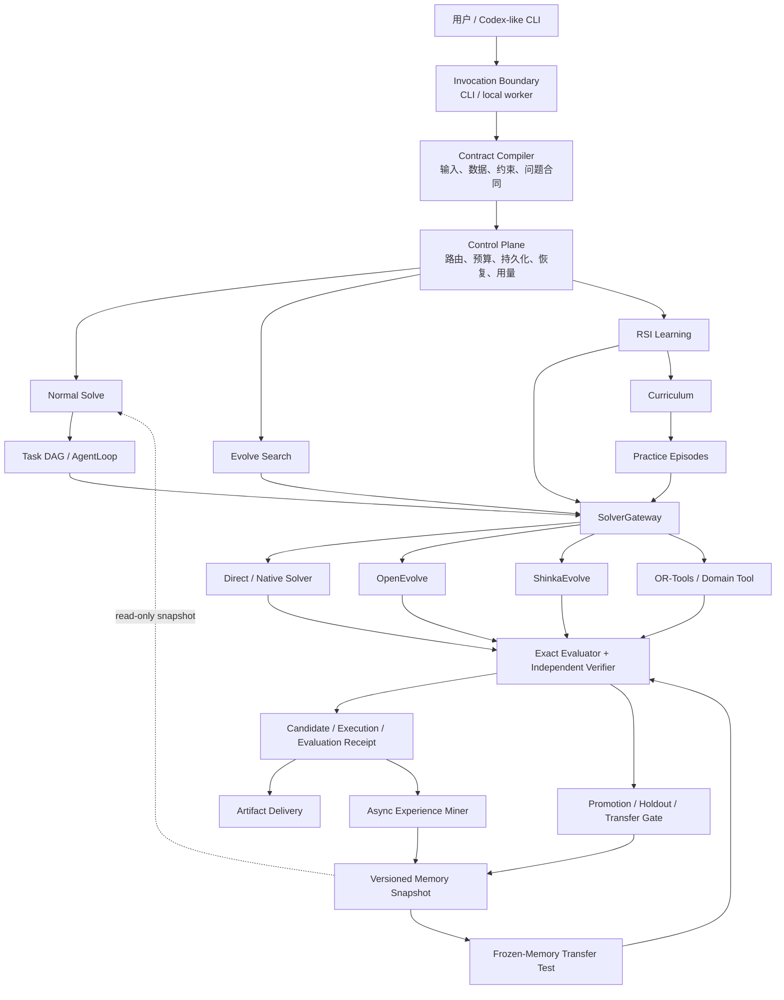

# Lunar Agent 总体架构与 RSI 接入设计草案

**状态：设计草案；以下实现状态以当前代码、HANDOFF 与 stage-gap-report 为准。**

**Feature：160 — RSI learning mode**

**目的：供 SDD 审阅，不代表本文所述的新增能力已经全部实现。**

## 1. 设计结论

Lunar Agent 的产品形态是一个类似 Codex 的本地算法 Agent：用户提交自然语言需求、数据和约束，Lunar 负责理解问题、组织任务、调用工具或求解器、执行独立评测，并返回结果和证据。

它不是单一的演化算法，也不是把所有 solver 并行跑一遍再挑最高分的调度器。建议保持三条清晰的入口：

1. **Normal**：默认在线求解流程。它先编译算法合同，再运行普通 Task DAG；必要时调用工具或直接求解器，但不会自动启动候选演化或 RSI 递归探索。
2. **Evolve**：针对当前问题的候选算法搜索。它调用 Native Population、OpenEvolve、ShinkaEvolve 或其他 solver/workflow，在同一个问题合同和 evaluator 下比较候选。
3. **RSI**：面向跨任务、跨 episode 的学习控制层。它可以调用 Normal 的 solve 流程和 Evolve 的 solver，但自身负责课程选择、独立验证、经验晋级、版本兼容和恢复。

RSI 还要拆成两个互补部分：

- **Transfer Memory（可迁移经验）**：普通请求只读一个冻结、版本化、已批准的经验快照；请求结束后的经验提取和晋级异步进行，不改变当前请求的控制流。
- **Recursive Exploration（递归探索）**：显式启动的长任务，用有限轮次练习失败边界或能力缺口，再将通过验证的经验提交到新的快照。

这样既保留 Lunar 作为算法求解控制框架的主线，也避免把一次 solver 内部的 population/island 状态误当成跨任务学习能力。

## 2. 当前仓库基线

以下是对当前代码和已有规格的基线核对结果：

| 能力 | 当前状态 | 依据 |
| --- | --- | --- |
| Codex-like `solve` 入口 | 已有 | `src/lunar_evolution/cli.py`、`conversational.py` |
| 算法合同编译 | 已有 | `RuntimeContractCompiler`、`AlgorithmProblemContract` |
| 默认普通 DAG | 已有 | `README.md`：`data_discovery → formulate → solve → verify` |
| 五阶段 role DAG | 已有可选路径 | `--role-dag`，DataDiscovery/Formulator/Solver/Evaluator/Reviewer |
| 当前任务的 Evolve | 已有显式入口 | `solve --evolve`、`evolve`、Native Population/OpenEvolve 接线 |
| OpenEvolve/Shinka | 已有本地 adapter/fixture 和导入边界 | Feature 153、`rsi_gateway.py`、相关 handoff 规格 |
| RSI 协议数据模型 | 已有 provider-free MVP | `rsi_learning.py`、`rsi_store.py`、Feature 160 |
| RSI BRS/DRS fixture | 已有 | `rsi_controller.py`、相关测试 |
| RSI CLI | 已有本地 fixture 入口 | `rsi run|inspect|reconcile`；不会启动真实 producer |
| 真实 Actor 环境和独立重开 evaluator | 本地 clean-room/sidecar 已完成；真实官方 evaluator 与生产环境仍开放 | Feature 160 T160-12 |
| RSI controller 级 durable resume | 本地 durable resume、unknown gate、fingerprint drift 与 native replay 已完成；外部 worker ownership/可信对账仍开放 | Feature 160 T160-13、阶段差距报告 A1/A2 |
| 普通 `MemoryStore` 与 RSI memory 隔离 | 设计上已确定 | RSI spec/data-model；仍需继续强化接线 |

因此，本文不把 provider-free fixture、已有协议或本地 adapter 描述成真实 OpenEvolve、Shinka 或外部环境评测已经完成。

## 3. 总体架构



### 3.1 Control Plane

Control Plane 是 Lunar 的系统级权威，负责：

- 接收用户请求并生成 `TaskContract`；
- 选择 Normal、Evolve 或显式 RSI 入口；
- 分配墙钟、模型请求、工具调用、solver、evaluator 和 verifier 预算；
- 持久化 run、task/episode、candidate、receipt、worker 和恢复状态；
- 校验 contract/evaluator/environment/model/solver fingerprint；
- 决定哪些结果可以交付，哪些结果只能作为诊断；
- 管理 memory snapshot 的晋级、回滚、废弃和重新验证；
- 统计 token、请求数、工具步数、solver 调用数、evaluator 时间、墙钟和可配置成本。

Solver、Actor 和普通模型响应都不能绕过 Control Plane 直接写 RSI memory 或宣布验证通过。

### 3.2 Solver Plane

Solver Plane 只表达“如何为当前合同产生候选或结果”：

- `DirectSolverAdapter`：直接调用模型或确定性求解器；
- Native Population：Lunar 自有候选演化；
- OpenEvolve：候选程序演化 workflow；
- ShinkaEvolve：候选程序演化 workflow/导入器；
- OR-Tools 等领域库：确定性约束/优化工具；
- 未来其他 solver plugin。

它们都通过 `SolverGateway` 进入 RSI 或 Evolve 流程，但语义不相同：OpenEvolve/Shinka 是搜索 workflow，OR-Tools 是领域求解库，DirectSolverAdapter 是调用边界，RSI 不是其中任何一个 solver。

OpenEvolve 内部可以调用 `DirectSolverAdapter`，但这属于 OpenEvolve workflow 的内部组合；对 Lunar 控制面仍表现为一个具有固定 contract、budget、receipt 和恢复语义的 solver adapter。

### 3.3 Learning Plane

Learning Plane 负责跨请求的学习，不负责替代当前请求的 evaluator：

- `ExperienceRead`：在请求开始时选择兼容的冻结 snapshot，只读注入；
- `ExperienceMiner`：从已完成且有证据的 episode 提取条件—动作—结果经验；
- `IndependentVerifier`：在 memory 晋级前重新核对 receipt、contract、evaluator 和环境；
- `MemoryAdmission`：通过 holdout/benchmark/兼容性门后生成 immutable snapshot；
- `Recursive Exploration Runner`：在显式 RSI 运行中规划练习、调用 solver、验证并晋级。

普通会话使用的 `MemoryStore` 可以继续保存显式对话记忆，但不拥有 RSI memory 的晋级权限。

## 4. 三种流程的关系

### 4.1 Normal：最基本的在线流程

```text
用户请求
  → 编译 AlgorithmProblemContract
  → 读取一个兼容的 ExperienceSnapshot（可选，只读）
  → 普通 Task DAG / AgentLoop
  → 工具或 DirectSolverAdapter
  → Exact Evaluator / Verifier
  → 交付结果、artifact 和 SolveReceipt
  → 异步提取经验（不阻塞当前请求）
```

当前默认 DAG 是 `data_discovery → formulate → solve → verify`；`--role-dag` 选择更细的五阶段角色计划。Normal 不自动进入 Evolve，也不自动进入 RSI 递归 loop。

### 4.2 Evolve：当前问题内的候选搜索

```text
固定问题合同 + evaluator
  → 选择一个显式 strategy/solver
  → 生成 candidate
  → 执行 candidate
  → 独立评估并产生 receipt
  → 记录 parent/child、iteration、population/island/archive
  → 选择当前问题的交付候选
```

Evolve 的 population、island、iteration、elite 和 checkpoint 属于这个 solver run。它们可以作为 provenance 保留，但不会自动进入跨任务 RSI memory。

### 4.3 RSI：显式的学习控制层

```text
显式 rsi run / 后台 learning job
  → Curriculum 选择 target/practice
  → Actor 复用 Lunar solve 和 SolverGateway
  → Exact Evaluator 产生权威 receipt
  → Independent Verifier 判断 pass/fail/unresolved
  → 生成 candidate memory
  → compatibility + holdout/benchmark gate
  → promote 为新的 immutable MemorySnapshot 或 reject/rollback
  → frozen-memory transfer test
```

RSI 可以调用 Normal 和 Evolve，但不能改变它们的权威边界。它不是“第五轮隐藏 loop”，也不是把所有 solver 自动并行后选择最高分。

### 4.4 BRS 和 DRS：递归探索的两种调度策略

BRS 和 DRS 都属于 RSI 的 `Recursive Exploration`，不是两个新的 solver，也不是两个独立的 Agent。

**BRS（Broad/宽展开）** 在同一个冻结的 parent memory 上同时启动多个 practice：

```text
冻结 parent snapshot
        │
   ┌────┼────┐
   ▼    ▼    ▼
practice A  practice B  practice C
   │    │    │
   └────┼────┘
        ▼
独立验证全部 episode
        ▼
按 ordinal 顺序提交通过的 child memory
```

BRS 适合还不知道哪种策略有效时做横向探索。每个 practice 只能读取同一个 parent snapshot，不能读取同一 wave 中其他 practice 尚未提交的结果；任一 worker 处于 `unknown`、超时或无法验证时，整轮不能继续晋级。

**DRS（Deep/目标驱动）** 先尝试目标任务，再根据失败诊断选择练习：

```text
target attempt
      │
      ├── pass ───────────────→ 完成
      │
      └── fail / capability gap
                    ▼
             选择针对性 practice
                    ▼
             独立验证并提交经验
                    ▼
             用新 snapshot 重试 target
```

DRS 适合已经观察到具体能力缺口时逐步深挖。它是串行的 `target → practice → retry` 循环；失败、`unknown`、`timed_out`、`abandoned` 或 `cancelled` 不会被当作成功经验，必须先恢复或终止本轮。

两者的差异可以概括为：

| 策略 | 探索方向 | 并发关系 | 经验提交 |
| --- | --- | --- | --- |
| BRS | 横向探索多个可能的练习 | practice 可并行，但共享同一个 frozen parent | 验证完成后按固定顺序合并 |
| DRS | 围绕一个目标失败逐步深入 | target、practice、retry 串行 | 每次通过后生成新 snapshot，再重试目标 |

第一版建议先以 DRS 证明完整闭环，再使用 BRS 扩展广度。两者都复用同一个 `SolverGateway`、evaluator、verifier、memory admission 和 recovery 协议。

## 5. RSI 的两块能力

### 5.1 可迁移经验：在线只读、异步更新

一次普通请求绑定 `memory_snapshot_sha256`。请求执行期间 snapshot 不变，异步学习即使完成也不会改变正在执行的请求。

经验条目至少携带：

```text
memory_id
problem_family / scope
trigger / condition
strategy / action
observed_result / expected_result
failure_boundary / applicability
source_episode_id
receipt_digest
solver_id + solver_version
evaluator_id + evaluator_version
contract_fingerprint
environment_fingerprint
model_fingerprint
parent_snapshot_digest
status / confidence / last_validated_at
```

推荐状态：`candidate → approved | rejected | unresolved`，历史快照还可标记 `stale`、`needs_revalidation` 或 `archived`。

### 5.2 递归探索：显式、有限、可恢复

递归探索拥有独立的：

- 最大 wave/depth；
- practice episode 数；
- target attempt 数；
- solver/evaluator/verifier 调用数；
- token、工具步数、墙钟和估算成本；
- no-improvement 和 unknown retry 上限。

每个 practice 使用独立 workspace，并冻结 contract、evaluator、environment 和 parent memory snapshot。只有通过独立验证、兼容性检查和 transfer/holdout gate 的结果，才可以生成 child snapshot。

## 6. 请求路由规则

路由不是“模型猜一个 solver 然后全部并行”。建议按以下优先级：

1. 用户显式指定 `normal`、`evolve` 或 `rsi` 时，遵循显式选择；
2. `solve --evolve` 或 `evolve` 进入当前任务的 Evolve；
3. `rsi run` 进入独立 RSI learning job；
4. 没有显式选择时，进入 Normal；
5. Normal 可以读取已批准经验，并可以调用一个合适的 solver/tool；
6. 只有明确的 portfolio/比较配置才允许运行多个 solver，且每个 solver 必须共享同一合同、evaluator 和预算上限；
7. 一个 solver 的失败或低分不会自动触发 Gödel/DGM 式自修改，也不会无界地升级为 RSI。

未来可以增加一个受控的 `strategy selector`，但它只负责选择已注册能力，不拥有修改 Lunar 控制层源码的权限。

## 7. 证据、版本漂移与记忆失效

### 7.1 权威证据链

一次可迁移学习至少需要：

```text
candidate source
  + dependencies
  + contract/input identity
  + environment fingerprint
  + actor/solver fingerprint
  + execution evidence
  + official evaluator receipt
  + independent verifier decision
```

solver 的自报分数、模型文本或未验证 trace 只能作为 provenance，不能替代 official evaluator receipt。

### 7.2 版本漂移门

请求或恢复时，对以下指纹做兼容性检查：

- contract/schema；
- evaluator 和 verifier；
- solver/workflow 及 settings；
- environment/dependencies/tool capabilities；
- model/profile；
- memory snapshot parent/digest。

不兼容时不能静默混用。最小处理策略是：

1. 标记 snapshot/entry 为 `stale` 或 `needs_revalidation`；
2. 只读降级为不使用该经验，继续当前 Normal 求解；
3. 在独立 revalidation/holdout 通过后重新批准；
4. 失败则 reject 或 rollback 到 parent snapshot。

### 7.3 Frozen transfer

Transfer test 必须关闭 curriculum 和 memory write，只读取固定 snapshot。transfer 的结果用于测量迁移效果，不能在测试过程中反向修改 snapshot。

## 8. 状态与恢复

### 8.1 worker 语义

Control Plane 统一保留：`running`、`idle`、`completed`、`failed`、`cancelled`、`unknown`。

`unknown` 表示系统无法证明 worker 是否完成，不能当成失败，也不能直接重试。必须进入 reconcile：检查进程归属、heartbeat、workspace、receipt、evaluator evidence 和 fingerprint，再落到 `completed`、`failed`、`abandoned`、`drifted` 或 `manual-review`。

### 8.2 RSI 状态

```text
run:      created → running → paused → running → completed
                         └→ failed | cancelled | unknown
episode:  planned → running → completed | failed | timed_out |
                    abandoned | cancelled | unknown
memory:   candidate → approved | rejected | unresolved
transfer: planned → running → completed | failed | unresolved
```

恢复必须复用同一 request digest 和 episode identity。已有 terminal receipt 的 episode 不得重新执行；已知 side effect 不得通过“重试”复制。BRS wave 必须从同一 frozen parent 启动，并按确定顺序提交通过的 child memory。

当前代码已具备 ledger、episode、reconcile CLI 和 fixture 级状态检查；controller-level durable resume、完整 unknown reconcile 和真实外部 worker 生命周期仍属于后续建设项。

## 9. 预算与用量统计

预算属于 Control Plane，不由 solver 自己解释。至少记录：

- 模型请求次数、输入/输出 token（未知时明确标记 unknown）；
- 工具调用次数和工具步数；
- solver invocation、candidate attempts、iteration；
- evaluator/verifier 次数和耗时；
- wall-clock、CPU/GPU 时间（可用时）；
- 本地估算成本和预算上限；
- retry、unknown reconcile 和 cleanup 次数。

Normal、Evolve、RSI 使用各自的子预算，但必须受同一个父级 run/deadline 约束。重试不能通过省略 control、复制旧摘要或创建新的未绑定 worker 来放宽预算。

## 10. 与当前实现的兼容性

| 现有能力 | 设计中的位置 | 兼容结论 |
| --- | --- | --- |
| `solve` + Contract Compiler | Invocation/Normal | 保持不变 |
| 普通 DAG 和 `--role-dag` | Normal AgentLoop | 保持不变，RSI 只复用其执行边界 |
| `solve --evolve` | Evolve handoff | 保持显式，不改成自动 RSI |
| Native Population | SolverGateway 下游 | 保留 population 语义，不转成 memory |
| OpenEvolve | SolverGateway 下游 | 保留 workflow，可由 RSI 调用 |
| ShinkaEvolve | SolverGateway 下游 | 保留导入/未来 launcher 边界，可由 RSI 调用 |
| OR-Tools | Domain solver/tool | 作为工具或 adapter，不与演化 workflow 混称 |
| `MemoryStore` | 普通显式会话记忆 | 不授予 RSI promotion 权限 |
| `RSILedger`/`RSIMemoryStore` | Learning Plane | 继续独立演进 |
| Feature 153 publication/recovery | Evolve/producer evidence | 作为 solver receipt 和恢复基础复用 |

该设计不要求重写 Normal DAG，也不要求把 Normal、Evolve、RSI 立即合并成同一个大控制器。建议先共享稳定原语：run identity、budget、receipt、artifact provenance、worker state 和 recovery。

## 11. 分阶段建设

### 阶段 0：协议与基线（当前）

- 保持已有 Feature 160 数据模型、fixture gateway、verifier、memory snapshot 和 transfer guard；
- 明确普通 MemoryStore、solver population 和 RSI memory 的边界；
- 继续使用 CLI 和 SQLite 作为本地审计入口。

### 阶段 1：可恢复 RSI（P0）

- controller-level durable resume；
- unknown reconcile gate；
- 统一递归深度、practice、solver、evaluator 和 retry 预算；
- fingerprint drift gate；
- 不重复 side effect 的中断恢复验收。

### 阶段 2：可信学习闭环（P1）

- clean-room independent verifier；
- memory admission、holdout/benchmark gate；
- frozen transfer regression；
- stale、revalidation、reject、rollback；
- 结构化失败边界和可审计 curriculum。

### 阶段 3：真实本地 solver 接线（P1）

- trusted launcher/bootstrap；
- OpenEvolve/Shinka process ownership、timeout、cancel、cleanup；
- durable producer receipt、unknown recovery、publication/parent delivery；
- 在统一 SolverGateway contract 下运行真实本地 campaign。

### 阶段 4：受控研究扩展（P2）

- 更丰富的失败驱动 curriculum；
- 可选 harness/skill evolution；
- 受限 mutable surface、candidate lineage、archive、rollback 等机制的进一步复用。

### 阶段 5：独立 Model Adaptation 轨道（P3，可选）

模型权重更新、SFT 或 RL 可以作为未来实验方向，但不属于当前 test-time RSI 的缺失前置能力，也不应混入 `RSILearningController` 的 memory 状态机。若未来实施，应使用独立的 model-adaptation contract、训练预算、checkpoint、holdout 和 rollback。

## 12. 当前明确不做

- 多租户、权限计费和远程分布式 scheduler；
- 完整 Web UI（先保留 CLI、ledger、receipt、inspect/reconcile）；
- Gödel/Darwin Gödel 式 Lunar 自身任意源码修改；
- 把 Gödel/DGM 作为当前主线 solver；
- 自动并行所有 solver 的默认路由；
- solver population/island 到跨任务 memory 的直接转换；
- 第一阶段的模型权重更新、SFT、RL；
- vector memory、跨 solver 自动 memory translation 和复杂 bandit/RL curriculum。

可以借鉴 candidate version、parent-child lineage、固定 evaluator、benchmark gate、archive、rollback 和受限 mutable surface，但这些机制服务于候选和 memory 的审计，不改变 Lunar 控制层的权限边界。

## 13. 验收标准

设计进入下一阶段前，至少满足：

1. Normal 默认只完成一次在线 solve；不会隐式启动 RSI 递归；
2. Evolve 和 RSI 可以通过同一 SolverGateway 调用 solver，但 receipt 和权限边界保持一致；
3. 失败、超时、abandoned、cancelled、unknown episode 不能生成 approved memory；
4. 同一 frozen snapshot 在 transfer test 中不可被写入；
5. contract/evaluator/environment/solver/model 漂移会被拒绝、降级或要求重新验证；
6. BRS/DRS 中断恢复不会重复已完成的 solver/evaluator side effect；
7. 现有 Normal DAG、Native Population、OpenEvolve、Shinka、普通 MemoryStore 和 Feature 153 回归不受破坏；
8. CLI 能查看 run、episode、receipt、memory snapshot、预算和 reconcile 状态；
9. 真实 solver 或外部环境验收与 provider-free fixture 分开登记，不能互相替代。

## 14. 需要后续确认的问题

1. 默认 Normal 是否只读取 problem-family 级 snapshot，还是同时允许 global snapshot？
2. 经验提取是否由本地后台 worker 执行，还是先由显式 `rsi learn` 命令触发？
3. 第一版 transfer gate 使用固定 holdout，还是使用已有 benchmark bundle？
4. OpenEvolve/Shinka 的真实 launcher 接线完成后，是否允许 RSI 选择它们，还是先只允许 Native/Direct solver？
5. 用量统计中的 token/cost 在 provider 返回 unknown 时采用何种展示和结算规则？

这些问题不影响当前主架构：Normal 是默认在线求解，Evolve 是当前问题内搜索，RSI 是受控的跨 episode 学习控制层；普通请求不会自动进入递归学习 loop。
